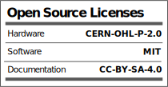

# ProtoCentral TLA20XX Arduino Library

The [Texas Instruments TLA2022/2024](https://www.ti.com/product/TLA2024) is one of the smallest high-performance, 12-bit sigma-delta analog-to-digital converter(ADCs) we've seen with an integrated voltage reference and programmable gain amplifier (PGA). With a sampling rate of up to 3.3 kSPS, the TLA20XX is ideal for a wide range of applications, including data acquisition, measurement, and control systems. 

One of the key features of the TLA20XX is its sigma-delta architecture, which enables it to deliver high resolution and excellent linearity. The ADC also has a built-in reference that provides a stable and accurate voltage reference, ensuring consistent and reliable conversion results.

The TLA2022 and TLA 2024 also include a programmable gain amplifier (PGA) that allows users to adjust the gain of the input signal, making it possible to amplify or attenuate the signal as needed. This feature is especially useful in applications where the input signal may be too small or too large for the ADC to handle.

In terms of connectivity, the TLA20XX includes an I2C interface, making it easy to interface with a variety of microcontrollers and other devices. This ADC's supply voltage range is quite wide, from 2V to 5.5V, which means that it can powered from and operated from a 3.3V or 5V compatible system such as an Arduino without the need for level shifters or other regulators.

The ProtoCentral tinyADC and tinyGSR breaakout boards use this ADC and library for data acquisition.

# Features

* 12-bit Sigma-Delta ADC
* 4 single-ended or 2 fully differential inputs (on the TLA2024, one on the TLA2022)
* Integrated voltage reference
* Integrated Programmaable Gain amplifier (PGA)
* Supply voltage 2 V to 5.5 V DC
* Programmable sampling rate from 128 SPS to 3300 SPS
* I2C / Qwiic compatible interface

# Repository Contents

* This repository contains only the Arduino library software and examples

License Information
===================

This product is open source! Both, our hardware and software are open source and licensed under the following licenses:

Hardware
---------

**All hardware is released under the [CERN-OHL-P v2](https://ohwr.org/cern_ohl_p_v2.txt)** license.

Copyright CERN 2020.

This source describes Open Hardware and is licensed under the CERN-OHL-P v2.

You may redistribute and modify this documentation and make products
using it under the terms of the CERN-OHL-P v2 (https:/cern.ch/cern-ohl).
This documentation is distributed WITHOUT ANY EXPRESS OR IMPLIED
WARRANTY, INCLUDING OF MERCHANTABILITY, SATISFACTORY QUALITY
AND FITNESS FOR A PARTICULAR PURPOSE. Please see the CERN-OHL-P v2
for applicable conditions

Software
--------

**All software is released under the MIT License(http://opensource.org/licenses/MIT).**

THE SOFTWARE IS PROVIDED "AS IS", WITHOUT WARRANTY OF ANY KIND, EXPRESS OR IMPLIED, INCLUDING BUT NOT LIMITED TO THE WARRANTIES OF MERCHANTABILITY, FITNESS FOR A PARTICULAR PURPOSE AND NONINFRINGEMENT. IN NO EVENT SHALL THE AUTHORS OR COPYRIGHT HOLDERS BE LIABLE FOR ANY CLAIM, DAMAGES OR OTHER LIABILITY, WHETHER IN AN ACTION OF CONTRACT, TORT OR OTHERWISE, ARISING FROM, OUT OF OR IN CONNECTION WITH THE SOFTWARE OR THE USE OR OTHER DEALINGS IN THE SOFTWARE.

Documentation
-------------
**All documentation is released under [Creative Commons Share-alike 4.0 International](http://creativecommons.org/licenses/by-sa/4.0/).**

You are free to:

* Share — copy and redistribute the material in any medium or format
* Adapt — remix, transform, and build upon the material for any purpose, even commercially.
The licensor cannot revoke these freedoms as long as you follow the license terms.

Under the following terms:

* Attribution — You must give appropriate credit, provide a link to the license, and indicate if changes were made. You may do so in any reasonable manner, but not in any way that suggests the licensor endorses you or your use.
* ShareAlike — If you remix, transform, or build upon the material, you must distribute your contributions under the same license as the original.

Please check [*LICENSE.md*](LICENSE.md) for detailed license descriptions.